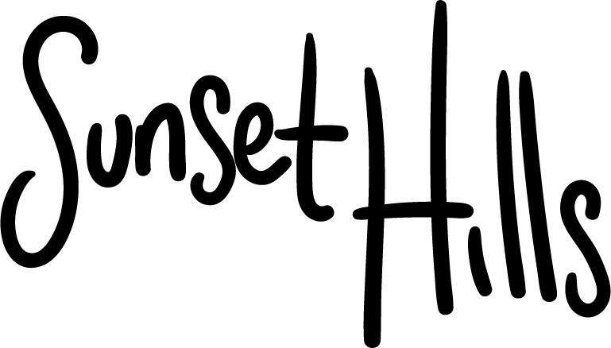

# Traversing Arrays

The Sunset Hills coding challenge is intended to assess a candidate’s ability to work with arrays. This challenge or a slight variation has been used by technology companies such as Amazon and was also featured on a Geeks for Geeks blog post titled “Amazon Interview Experience | Set 189 (For SDE-1)”.

## How It Works

This program has been modified to allow the user to enter their own values into an array before determining which "buildings" (positions in the array) can see the sunset. 

## Credits
Credits to these artists from dafont.com from providing the fonts I used in this build: Marsnev for “Lemon Milk’ and Chen Yining for ‘Louis George Café’.

## See This Website
[SUNSET HILLS | A Coding Challenge](https://sunsethillsj.netlify.app)

© Shyann Jobe 2020
